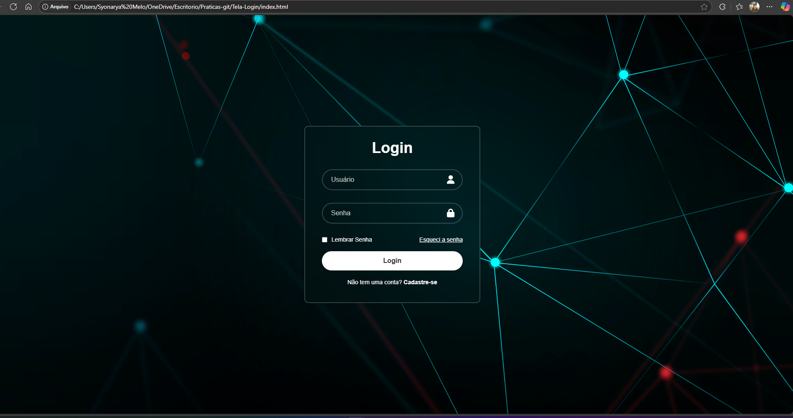

Tela-Login
Projeto simples de tela de login web com design moderno e responsivo, desenvolvido com HTML e CSS.

Descrição
Este projeto apresenta uma interface de login com:
Campos para usuário (email) e senha com ícones indicativos
Opção "Lembrar Senha" e link para recuperação de senha
Botão de login estilizado com efeito hover
Link para cadastro de novos usuários
Layout clean, fundo com imagem de fundo estilizada e efeito blur no container
Responsividade e usabilidade focadas na experiência do usuário
O design usa fontes do Google Fonts, ícones do Font Awesome e técnicas modernas de CSS como backdrop-filter para criar um visual atraente.

Tecnologias usadas
HTML5
CSS3 (Flexbox, backdrop-filter)
Font Awesome para ícones
Google Fonts para tipografia

